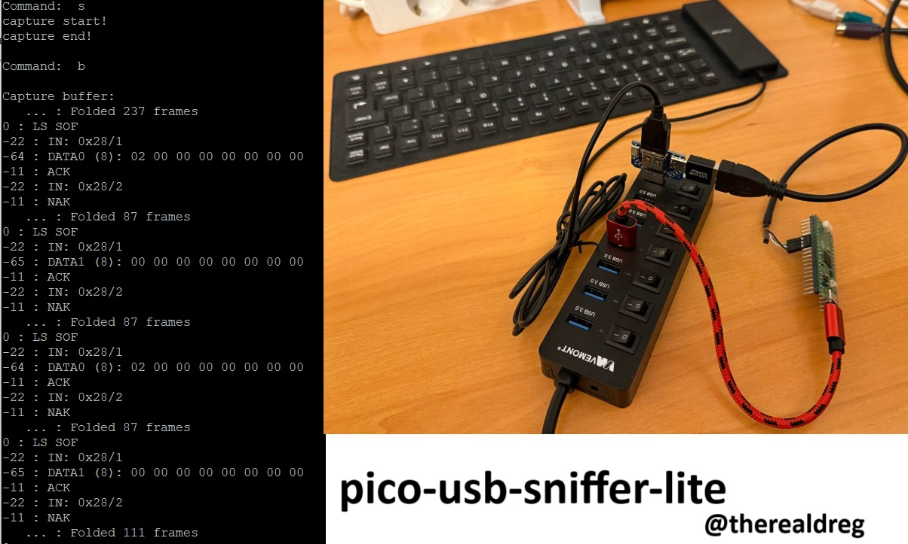
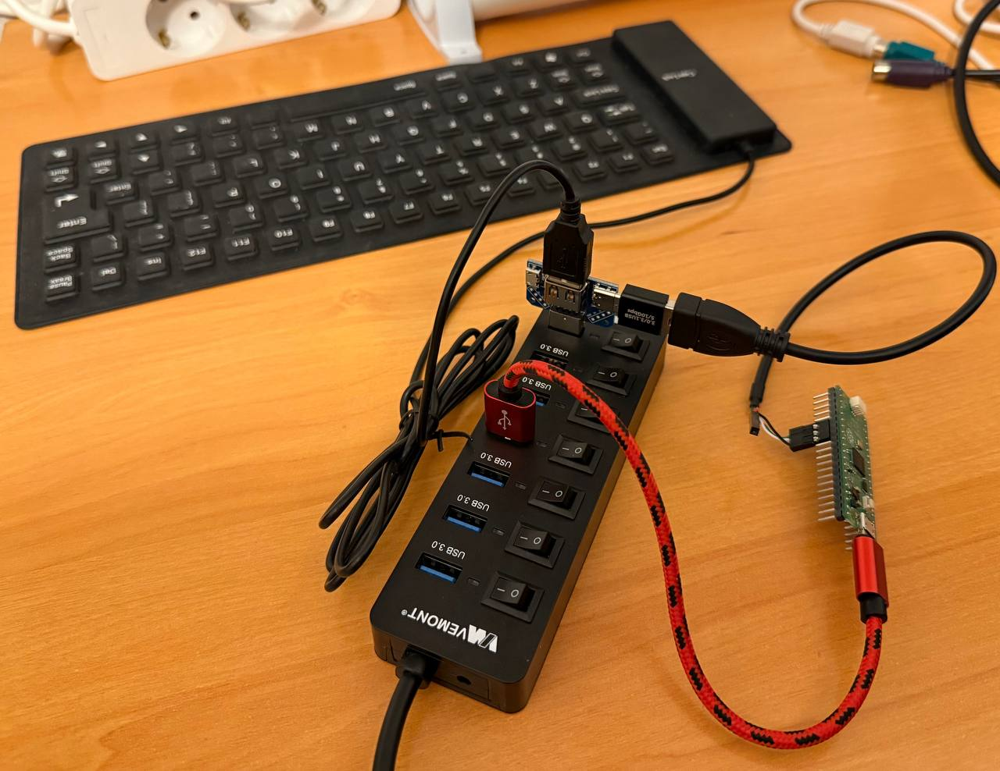
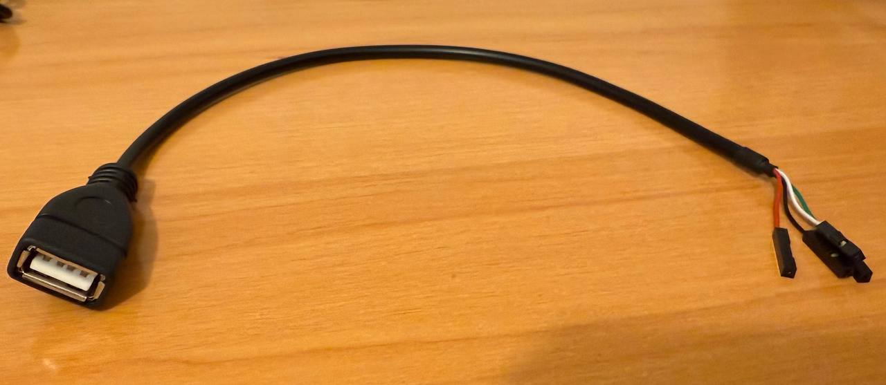
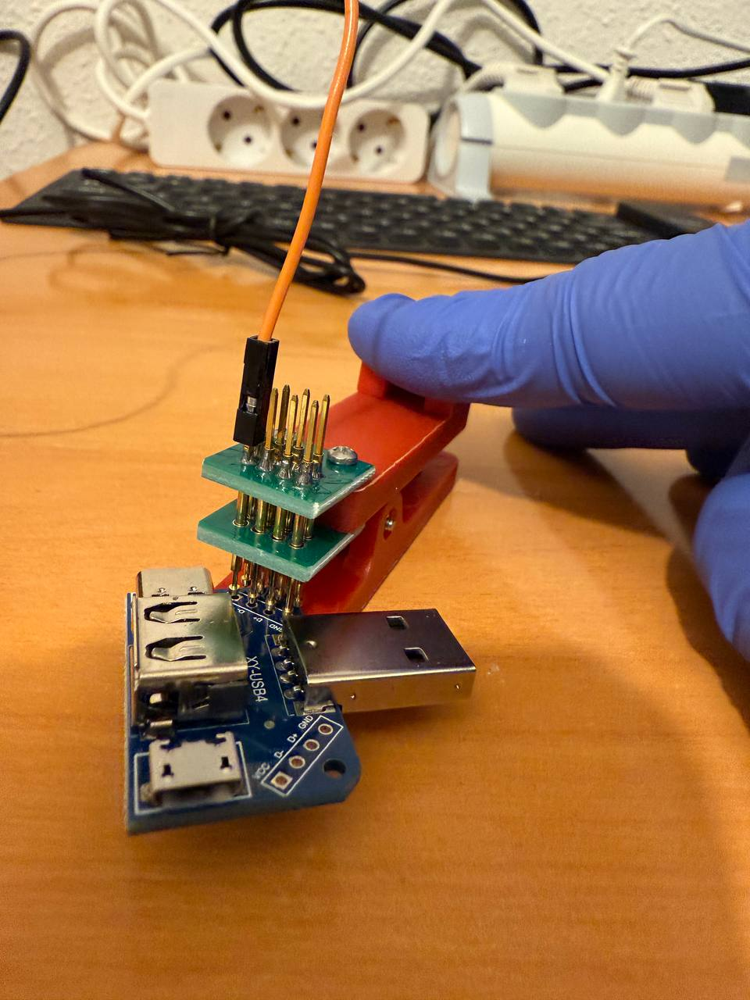
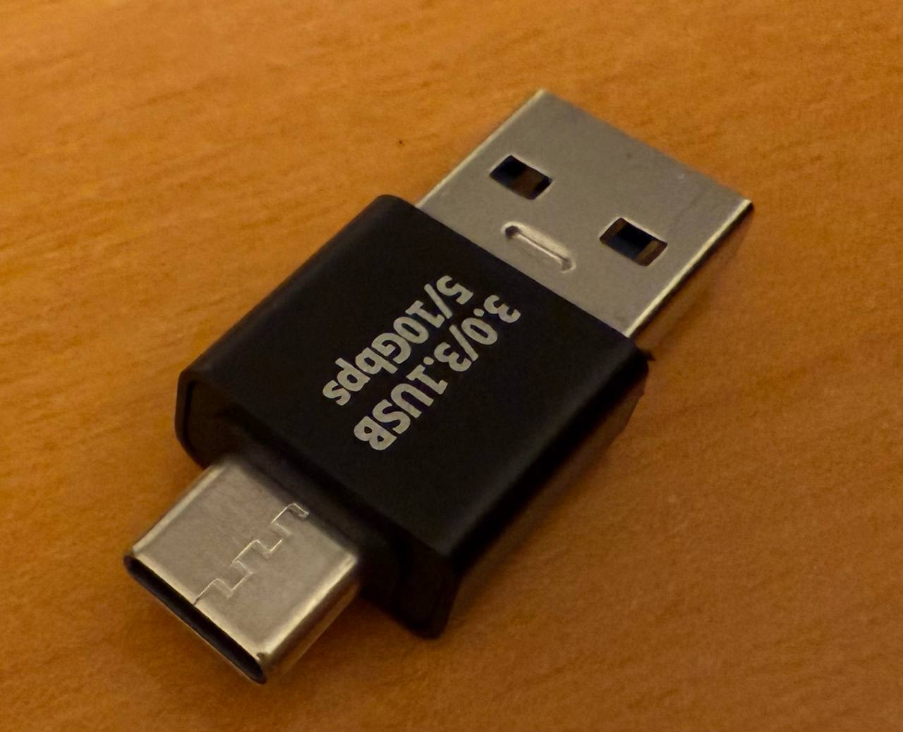
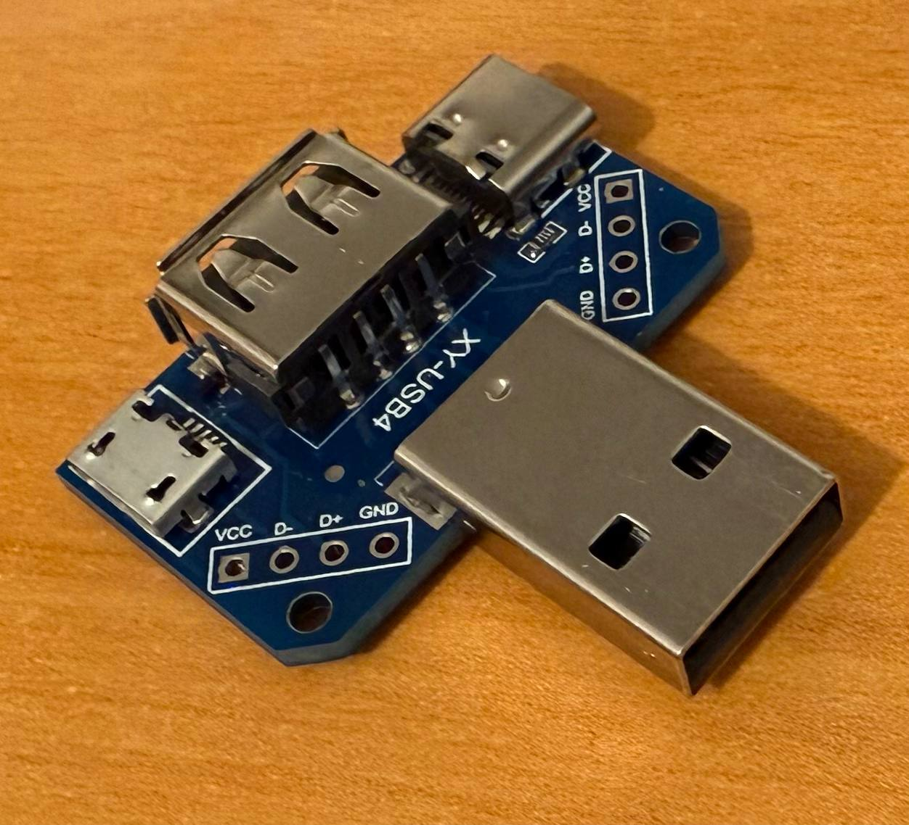
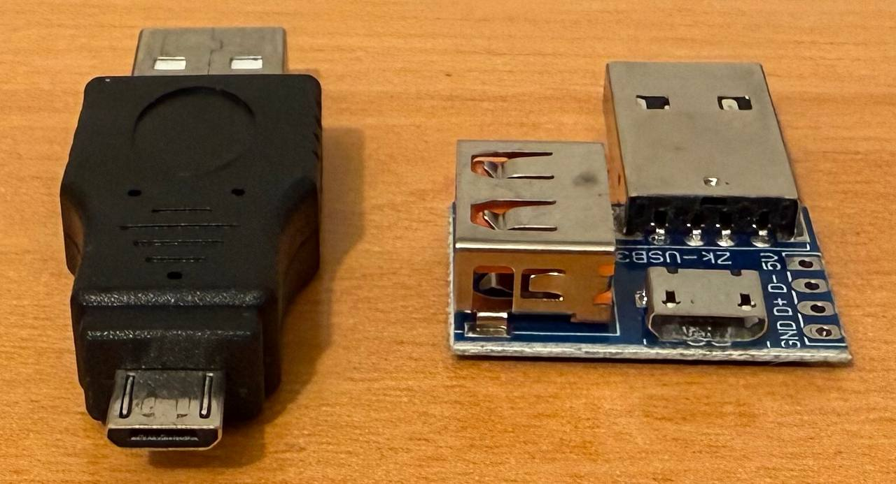
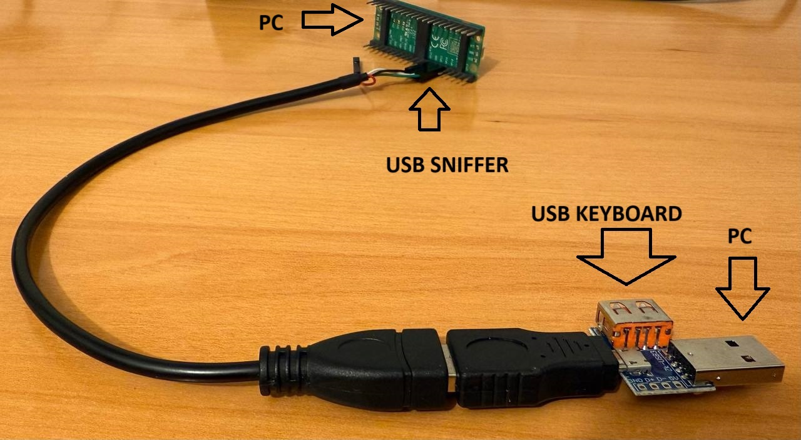
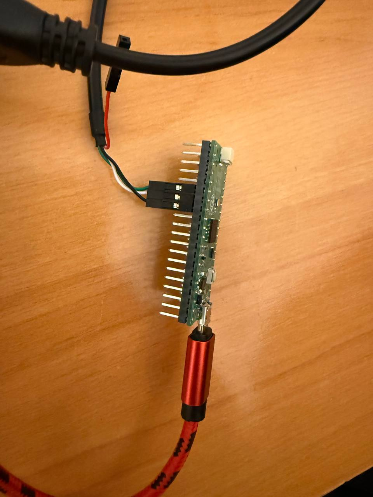

# USB sniffer for RASPBERRY PI PICO RP2040

This is a simple USB sniffer based on a Raspberry Pi PICO RP2040 (pico-sdk). It supports Low Speed and Full Speed modes.



The firmware presents itself as a virtual COM-port (VCP), so no additional software is necessary and it is compatible with all operating systems.

This is the Dreg's fork of the original baremetal project by Alex Taradov, which can be found:
https://github.com/ataradov/usb-sniffer-lite

I have ported everything (PIO+SRC) to pico-sdk and made some changes. It won't be exactly the same as the bare-metal version.

I created this project to ensure that all the effort I put into my okhi project (Open Keylogger Hardware Implant - USB & PS2 Keyboards) can benefit more people: https://github.com/therealdreg/okhi


# USB Cable color

- Green: D+
- White: D-
- Black: GND

# Download last firmware

Download the latest firmware from the releases section:

https://github.com/therealdreg/pico-usb-sniffer-lite/releases/latest

# Flashing the firmware

To flash the firmware, you need to put the Raspberry Pi Pico in bootloader mode. To do this, press and hold the button while connecting the USB cable to the PC. The Pico will appear as a USB mass storage device. Drag and drop the "pico_usb_sniffer_lite.uf2" firmware file to the Pico.

# Physical USB keylogger using a Raspberry Pi Pico

As an example, let's see how to make a physical USB keylogger without soldering anything. You only need a RASPBERRY PI PICO and some materials.



## Materials

- USB A FEMALE to DUPONT FEMALE cable:



https://aliexpress.com/i/1005004492194988.html

(with individual Dupont cables)

If you can't find that cable, you can use this "Probe" with regular female Dupont cables instead:

- Test Board Probe Holder Single row 4P 2.54mm:



https://aliexpress.com/item/1005006358713448.html

(I only had a double row one, but it works the same)

------

- USB C male to USB A male adapter



https://aliexpress.com/item/1005007809731446.html

- Micro Usb 5pin B Type Female Connector Pcb | Type C Female Micro Usb Male - Usb:



https://aliexpress.com/i/1005004336370054.html

(The one with USB C female, micro USB female, USB A Male, USB A Female, and a 2.54mm pin header)

-----

If you can't find that multiusb board you can buy the one with USB A Male, USB A Female, USB micro female and 2.54mm pin header



Also you need a USB micro male to USB A Male adapter:

https://www.aliexpress.com/item/4001187933894.html

The setup is the same:



The USB A Male from multi usb board goes to PC, and the USB A FEMALE from the multi usb board goes to the keyboard USB A Male.

----------

I assume you have a USB keyboard, Raspberry Pi Pico, dupont cable set (F-F, M-F, M-M)....

## Connect everything

Connect the female Dupont pins to the Raspberry Pi Pico as follows:

- Green cable (D+) to GPIO20
- White cable (D-) to GPIO21
- Black cable to a GND



Connect to the USB board:
- A USB A male keyboard
- The USB C Male to USB A Adapter. Then connect the USB A Female to DUPONT FEMALE cable to this adapter


Finally, connect everything to the PC, and you're done!

**WARNING**: some USB Hubs can cause problems with this setup. If you have problems, try connecting ALL directly to the PC.

**WARNING**: Use short cables to avoid signal degradation (USB & Dupont). Avoid stack adapters, etc.

## Inspecting USB low speed traffic

Connect to serial PORT (COM PORT) with a terminal program (like Putty, Tera Term, etc.), port conf:
- 9600 bauds
- data 8 bits
- parity none
- stop bits 1
- flow control none

To view available COM ports on Windows, open Device Manager and look for the "Ports (COM & LPT)" section.

**The COM port becomes available approximately 4 seconds after connection** (the firmware includes a delay before it starts).

```
-------------------------------------------------------------------
pico-usb-sniffer-lite v7 - Build date: Aug 19 2025, 21:02:43
https://github.com/therealdreg/pico-usb-sniffer-lite
https://github.com/therealdreg/okhi
BSD-3-Clause Alex Taradov & David Reguera Garcia aka Dreg
-------------------------------------------------------------------
Trigger: GPIO18, D+(GREEN): GPIO20, D-(WHITE): GPIO21, GPIO22 PIO internal
Reserved OKHI: GPIO9, GPIO8, GPIO26
Settings:
  e - Capture speed       : Low
  g - Capture trigger     : Disabled
  l - Capture limit       : 2000 packets
  t - Time display format : Relative to the first packet
  a - Data display format : Full
  f - Fold empty frames   : Enabled

Commands:
  h - Print this help message
  b - Display buffer
  s - Start capture
  p - Stop capture

Command:
```

Start pressing the shift key multiple times on the target USB keyboard while entering 's' in the terminal to start capturing USB traffic:
```
Command:  s
capture start!
capture end!
```

Press 'b' to view the captured traffic:
```
Command:  b

Capture buffer:
   ... : Folded 946 frames
0 : LS SOF
-22 : IN: 0x1F/1
-64 : DATA0 (8): 02 00 00 00 00 00 00 00
-11 : ACK
-22 : IN: 0x1F/2
-11 : NAK
   ... : Folded 175 frames
0 : LS SOF
-22 : IN: 0x1F/1
-65 : DATA1 (8): 00 00 00 00 00 00 00 00
-11 : ACK
-22 : IN: 0x1F/2
-11 : NAK
   ... : Folded 159 frames
0 : LS SOF
-22 : IN: 0x1F/1
-64 : DATA0 (8): 02 00 00 00 00 00 00 00
-11 : ACK
-22 : IN: 0x1F/2
-11 : NAK
   ... : Folded 47 frames
0 : LS SOF
-22 : IN: 0x1F/1
-11 : NAK

Total: error: 0, bus reset: 0, LS packet: 2000, frame: 1331, empty frame: 1327
```

## Hardware Connections

USB D+ and D- signals can be directly connected to the MCU pins. The default
pin assignments are shown in the following table:

| PICO PIN | GPIO    | Function | USB Cable Color |
|:--------:|:-------:|:----------------:|:-----:|
| GND      | GND     | Ground           | Black |
| 26       | GPIO20  | D+               | Green |
| 27       | GPIO21  | D-               | White |
| 29       | GPIO22  | Start (internal) | N/A   |
| 24       | GPIO18  | Trigger          | N/A   |
| 11       | GPIO8   | okhi (internal)  | N/A   |
| 12       | GPIO9   | okhi (internal)  | N/A   |
| 31       | GPIO26  | okhi led         | N/A   |


Trigger input is internally pulled up and the active level is low. When trigger is
enabled in the settings, the capture would pause until the trigger pin is pulled low.
Given the limited size of the capture buffer, trigger mechanism provides a way for
the debugged target to mark the part of interest.

**WARNING**: This project uses different GPIOs than the original project by Alex Taradov because okhi uses these GPIOs.

# Examples

Here are a couple of example capture logs for the [enumeration](stuff/usb_fs_enumeration.txt) and a regular [data transfer](stuff/usb_fs_data.txt).

This sniffer has no packet decoding capabilities, but there is an excellent online
[USB Descriptor and Request Parser](https://eleccelerator.com/usbdescreqparser/)
that is very helpful with decoding of the standard descriptors and requests.

## Settings

The following settings are supported:

* Capture speed (e) -- Low / Full
* Capture trigger (g) -- Enabled / Disabled
* Capture limit (l) -- 100/200/500/1000/2000/5000/10000 packets / Unlimited
* Time display format (t) -- Relative to the first packet / previous packet / SOF / bus reset
* Data display format (a) -- Full / Limit to 16 bytes / Limit to 64 bytes / Do not display data
* Fold empty frames (f) -- Enabled / Disabled

A frame is delimited by the SOF packet in the Full Speed mode or by a keep-alive signal in
the Low Speed mode.

An empty frame is a frame that contains no packets other than IN/NAK and contains no packets
with errors detected. Folding of the empty frames shortens the displayed information by
combining consecutive empty frames into one entry, since they don't carry useful information,
but happen very often in a typical USB transaction.

## Commands

The following commands are supported:

* Print the help message (h)
* Display current buffer (b)
* Start capture (s)
* Stop capture (p)

Once capture is started and the trigger condition is met, the sniffer captures the specified
number of packets. After the capture is done, the buffer is displayed using current settings.

The display settings may be adjusted without a new capture. Once the buffer is captured,
it is stored in the memory and can be displayed again using a `b` command.

# Learn resources

- https://github.com/therealdreg/okhi
- https://www.usbmadesimple.co.uk/
- https://www.beyondlogic.org/usbnutshell/usb1.shtml
- https://forums.raspberrypi.com/
- https://datasheets.raspberrypi.com/pico/getting-started-with-pico.pdf
- https://datasheets.raspberrypi.com/pico/raspberry-pi-pico-c-sdk.pdf
- https://datasheets.raspberrypi.com/rp2040/rp2040-datasheet.pdf
- https://github.com/therealdreg/okhi/blob/main/stuff/USB_doc.pdf
- https://www.eevblog.com/forum/projects/usb-sniffer-using-rp2040/
- https://www.eevblog.com/forum/projects/pico-usb-sniffer-lite/
- https://forums.raspberrypi.com/viewtopic.php?p=2283134#p2283134

# Related

- https://github.com/therealdreg/pico-ps2-sniffer

# Developers

Instructions for building & debugging the firmware step-by-step can be found in the okhi repository:

https://github.com/therealdreg/okhi?tab=readme-ov-file#developers-setup


# CHANGELOG

## v7 2025-08-19

- okhi support: led, usb switch, button press...
- better DOC
- default settings: low speed, specific limit, time rel to first packet...
- better UI/UX experience
- minor & cosmetic changes

## v5 2025-01-05

- print BUILD DATE
- more DOC
- TIME implemented
- CDC reset connection on main for SWD programming
- minor & cosmetic changes

## v3 2025-01-05

Ported & adapted, but not strictly 100% equal to the original

- Initial PICO SDK version
- ONE FILE project
- GPIO & Trigger info added to the output
- PIO Code ASM
- Some changes to make it work with PICO SDK
- Added some comments for educational purposes
- Stop capture command not implemented (I don't like accessing CDC-STDIO from different cores, and for now, it is blocking)
- TIME not implemented yet
- Added a PIO stuck detector (NO USB Traffic??)
- clang-format
- new DOC + DIY project
- More things that I don't remember
